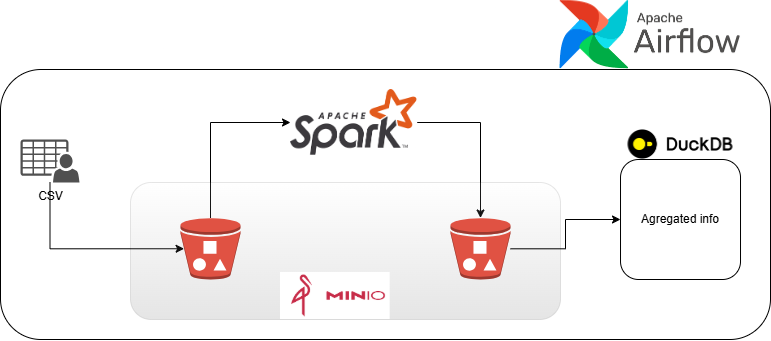
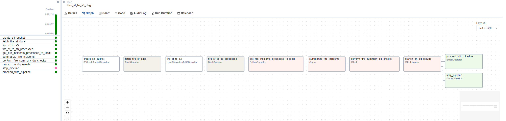

# Fire Challenge - Feature: Airflow, CI/CD & Testing

## 🔥 Branch Focus: Continuous Improvement on Airflow, CI/CD & Testing 🔥


### Run locally

To run locally, you need:

1. [git](https://git-scm.com/book/en/v2/Getting-Started-Installing-Git)
2. [Github account](https://github.com/)
3. [Docker](https://docs.docker.com/engine/install/) with at least 4GB of RAM and [Docker Compose](https://docs.docker.com/compose/install/) v1.27.0 or later

Clone the repo and run the following commands to start the data pipeline:

```bash
git clone -b feature/airflow-ci-cd https://github.com/MaoZao/fire-challenge.git
cd fire-challenge
make up
sleep 30 
make ci 
```
Go to [http:localhost:8080](http:localhost:8080) to see the Airflow UI. Username and password are both `airflow`.

Welcome to the `feature/airflow-ci-cd` branch! This branch is a dedicated workspace for the ongoing enhancement and modernization of the Fire Challenge project. Our primary efforts here are centered around three key pillars:

1.  **Apache Airflow Integration & Enhancement:**
    * Developing, refining, and managing data pipelines and workflows using Apache Airflow.
    * Exploring best practices for DAG (Directed Acyclic Graph) design, scheduling, monitoring, and alerting.
    * Aiming for more resilient, scalable, and observable data processes.

2.  **CI/CD Pipeline Implementation & Optimization:**
    * Building and improving automated pipelines for Continuous Integration (CI) to ensure that new code changes are frequently and reliably integrated and tested.
    * Establishing Continuous Delivery/Deployment (CD) practices to streamline the release process, enabling faster and more consistent delivery of new features and fixes.
    * Utilizing tools and techniques to automate builds, testing, and deployments.

3.  **Comprehensive Testing Strategies:**
    * Implementing and expanding various levels of testing (e.g., unit tests, integration tests, end-to-end tests) to ensure code quality and stability.
    * Focusing on test automation to provide quick feedback and reduce manual effort.
    * Adhering to testing best practices to catch bugs early and ensure the reliability of new and existing features.

## 🌱 Continuous Improvement Philosophy

This branch embodies a commitment to iterative development and continuous improvement. We believe that by focusing on these critical areas—Airflow for workflow orchestration, CI/CD for development agility, and rigorous testing for quality—we can significantly enhance the robustness, efficiency, and maintainability of the Fire Challenge project.

While the primary goals of this branch are complete and the features are working as intended, some final adjustments and refinements are underway to ensure a smooth and seamless integration with the `main` branch. This may include:

* Final code reviews and cleanup.
* Documentation updates.
* Addressing any minor pending tasks or feedback.
* Ensuring compatibility and resolving any potential conflicts with recent changes in `main`.

The aim is to merge these powerful enhancements into the main project codebase shortly, bringing improved automation, reliability, and development velocity to the Fire Challenge.

## 🎯 Goals for this Branch

* **Automate Everything:** Strive to automate repetitive tasks in the development, testing, and deployment lifecycle.
* **Improve Reliability:** Increase the stability and reliability of the application through comprehensive testing and robust data pipelines.
* **Increase Development Velocity:** Enable faster and more frequent releases of high-quality software.
* **Enhance Observability:** Improve the monitoring and logging capabilities of our Airflow DAGs and CI/CD pipelines.
* **Foster Best Practices:** Serve as a proving ground for modern DevOps and Data Engineering practices.

## 🛠️ Technologies & Focus Areas (Examples - customize as needed)

* **Workflow Orchestration:** Apache Airflow
* **CI/CD Tools:** (e.g., GitHub Actions)
* **Testing Frameworks:** (e.g., PyTest)
* **Containerization:** (e.g., Docker)

## 🤝 Contributing

Contributions, suggestions, and feedback on these areas are highly encouraged within this branch. If you are working on features related to Airflow, CI/CD, or testing, please base your work on this branch and submit Pull Requests here.

## 🖼️ Visual Representation

To visually represent our focus, here's an image that encapsulates the key elements of this branch:

 


## 🖼️ Visual DAGs

 
